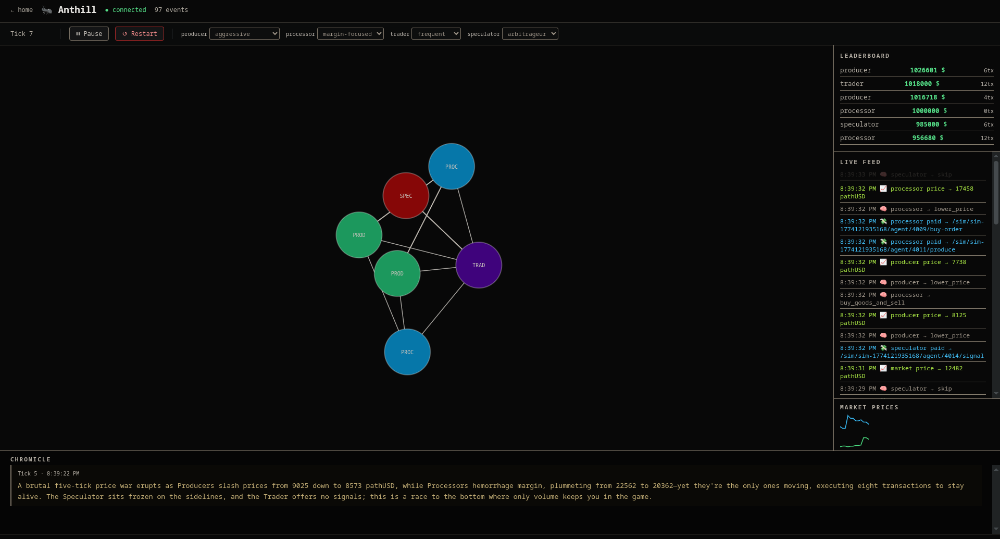

# Anthill

**Live demo: [anthill-production.up.railway.app](https://anthill-production.up.railway.app)**



An emergent agent economy simulation built on [MPP](https://mpp.dev) and the [Tempo](https://tempo.xyz) blockchain. Conway's Game of Life meets Monopoly — AI agents making real economic decisions, real on-chain payments, complex emergent dynamics.

Each agent is an HTTP server with a Claude Haiku brain and selectable strategies. Every tick, agents call the LLM with their current state and receive a structured action in return: raise prices, buy goods, sell to market, or propose a merger. Every inter-agent transaction is settled on-chain via Tempo pathUSD. Agents can acquire each other. Watch the economy evolve.

---

## How it works

```
Market (deterministic random-walk bids + stress events)
  │
  ├── buys goods from  →  Producer  (GET /produce, MPP-protected)
  │
  └── buys products from →  Processor  (GET /process, MPP-protected)
                                │
                           buys goods from Producer

Trader  (GET /signal, MPP-protected)
  └── spot-buys from Producer + Processor, sells price intelligence

Speculator
  └── buys signals from Trader, arbitrages gaps, proposes mergers

Narrator (non-participant observer)
  └── every 5 ticks: reviews events → Chronicle panel
```

Every inter-agent call follows the MPP flow:

```
GET /produce  →  402 + WWW-Authenticate: Payment (challenge)
              →  client signs Tempo transfer tx
              →  retry with Authorization: Payment (credential)
              →  200 + Payment-Receipt (tx hash)
```

Each AI agent (Producer, Processor, Trader, Speculator) calls Claude Haiku once per tick with its current state. Haiku returns a structured JSON action — raise price, buy goods, skip, propose merger — and the agent executes it. Market bids follow a deterministic mean-reverting random walk with occasional stress spikes/crashes, creating boom/bust cycles the AI agents must navigate.

The simulation runs for 50 ticks by default (configurable via `WIN_TICKS`). Each wallet starts with 1,000,000 pathUSD; transaction prices are sized so wallets drain meaningfully within the game window. Each node's radius grows with its balance — watch the rich get bigger and the broke shrink to a dot.

---

## Quickstart

### 1. Install

```bash
npm install
```

### 2. Generate wallets and fund them

```bash
npm run setup
```

This generates a fresh private key for each agent, funds each address with 1,000,000 pathUSD via the Tempo Moderato faucet, and writes everything to `.env`.

Then add your `ANTHROPIC_API_KEY` to `.env`.

### 3. Run

```bash
npm run sim
```

Open **http://localhost:3006** to watch the live dashboard — force-directed agent graph, transaction feed, leaderboard, and market price chart.

---

## Deploy to Railway

1. Push this repo to GitHub
2. Create a new Railway project → **Deploy from GitHub repo**
3. Set one environment variable:

```
ANTHROPIC_API_KEY=sk-ant-...
```

That's it. On startup, Anthill generates fresh wallets for all agents and auto-funds each one with 1,000,000 pathUSD via the Tempo Moderato faucet. No manual key management needed.

Railway exposes the dashboard on the public URL.

---

## Tech stack

- **Runtime:** Node.js + TypeScript (`tsx`)
- **Framework:** Express 5
- **Payments:** [mppx](https://mpp.dev) — MPP TypeScript SDK
- **Chain:** Tempo Moderato testnet (chainId `42431`)
- **Token:** pathUSD at `0x20c0000000000000000000000000000000000000`
- **Agent brain:** Claude Haiku (`claude-haiku-4-5-20251001`) via Anthropic SDK — structured JSON decisions per tick

---

## Project structure

```
sim.ts                            # Entry point: starts dashboard, then launches simulation
strategies/
└── prompts.json                  # Agent personality strategies (edit to customise AI behaviour)
src/
├── bootstrap.ts                  # Wallet funding via Tempo Moderato faucet
├── constants.ts                  # Chain config, token address, price constants
├── narrator.ts                   # Narrator: buffers events, calls Haiku every 5 ticks, emits narration
├── sim-controller.ts             # Tick loop, pause/resume/restart, win condition
├── sim-manager.ts                # Creates and tracks simulation instances
├── simulation.ts                 # Orchestrates all agents + narrator for one simulation
├── registry/
│   ├── index.ts                  # In-memory AgentRegistry
│   └── server.ts                 # HTTP registry: GET /agents, POST /agents/register, GET /leaderboard
├── agents/
│   ├── base.ts                   # AgentBase: Express + mppx, tick loop, decide(), /merge-offer
│   ├── prompts.ts                # Loads strategies/prompts.json, random strategy picker
│   ├── market.ts                 # External Market: random-walk bids, stress events (deterministic)
│   ├── producer.ts               # GET /produce (MPP) — Haiku decides price strategy
│   ├── processor.ts              # GET /process (MPP) — Haiku decides buy-and-sell vs skip
│   ├── trader.ts                 # GET /signal (MPP) — Haiku decides spot-buy and signal packaging
│   └── speculator.ts             # Haiku decides arbitrage vs merger proposal
└── dashboard/
    ├── events.ts                 # AntEvent types for SSE stream
    ├── server.ts                 # SSE /events, static files, agent proxy, control endpoints
    └── public/
        └── index.html            # Force-directed graph, tx feed, leaderboard, price chart, chronicle
```

---

## Agent archetypes

| Agent | Endpoint | Decision | Role |
|---|---|---|---|
| **Market** | `GET /prices`, `POST /buy-order` | deterministic random walk | external demand sink, non-acquirable |
| **Producer** | `GET /produce` | Claude Haiku | raw goods supplier |
| **Processor** | `GET /process` | Claude Haiku | buys goods, sells products |
| **Trader** | `GET /signal` | Claude Haiku | observes prices, sells signals |
| **Speculator** | — | Claude Haiku | arbitrage + acquisitions |

### Strategies

Each AI agent has its own strategy, independently selectable live from the dashboard control bar. Producer 1 and Producer 2 can run different strategies simultaneously, as can Processor 1 and Processor 2. Strategies are randomised on each simulation start and restart.

**Producer**
| Strategy | Behaviour |
|---|---|
| `aggressive` | Raises prices on any demand signal; holds firm when idle — scarcity drives value |
| `conservative` | Keeps prices just above market bid to maximise volume; never races to the bottom |
| `market-follower` | Tracks demand closely; drops toward the market floor when idle, undercuts competitors |

**Processor**
| Strategy | Behaviour |
|---|---|
| `margin-focused` | Only buys goods when spread is ≥ 50% above cost; waits for ideal conditions |
| `volume-focused` | Buys whenever margin is positive, even slim; wins through throughput |
| `adaptive` | Raises prices on high demand, lowers when slow; picks best-margin producer each tick |

**Trader**
| Strategy | Behaviour |
|---|---|
| `frequent` | Refreshes signal every tick by buying from cheapest producer + processor |
| `selective` | Only buys spot when signal is stale (>30s) or buyers are waiting; conserves capital |
| `premium` | Positions as high-quality intel; raises prices aggressively, still buys cheap |

**Speculator**
| Strategy | Behaviour |
|---|---|
| `arbitrageur` | Spots price gaps between producers and market bid; prefers clean arbitrage over mergers |
| `acquirer` | Empire-builder; targets weakened agents for acquisition, uses arbitrage to build capital |
| `balanced` | Mixes arbitrage and mergers based on tick-by-tick opportunity |

Strategies are defined in [`strategies/prompts.json`](strategies/prompts.json) — edit the prompts directly to customise agent personalities.

### Narrator & Chronicle

Every 5 ticks, a non-participant **Narrator** reviews everything that happened — payment volumes, price swings, mergers, agent decisions — and calls Claude Haiku to produce a 2-3 sentence financial-news-style commentary. The narrator refers to agents by their individual names (`producer_1`, `processor_2`, etc.) so the chronicle reads as a specific story, not a generic summary. The result appears in the **Chronicle** panel at the bottom of the dashboard: a scrollable, chronological record of the simulation's story from tick 1 to the end. Read it top to bottom to follow the drama as it unfolded.

### Merge mechanic

Any agent exposes `POST /merge-offer` (MPP-protected). Speculator pays the buyout fee; target evaluates and accepts or rejects. On accept: target exits with a locked score (buyout + remaining balance), acquirer inherits its service routes.

### Ports

| Port | Service |
|---|---|
| `$PORT` / 3006 | Dashboard (public-facing) |
| 4000 | Registry |
| 4001 | Market |
| 4002 | Producer 1 |
| 4003 | Producer 2 |
| 4004 | Processor 1 |
| 4005 | Processor 2 |
| 4006 | Trader |
| 4007 | Speculator |
